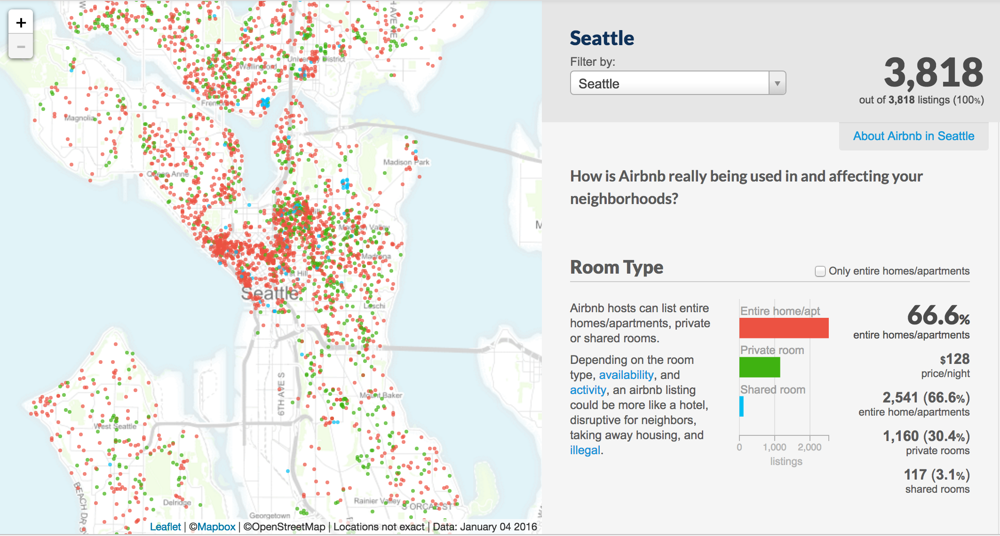

```{r setup, include=FALSE}
knitr::opts_chunk$set(echo = TRUE)
library(ggplot2) # graphics
library(dplyr) # data wrangling
library(cowplot) #plot grids
library(knitr) # fancy tables
library(GGally) # scatterplot matrices
library(tree) # regression trees
library(rpart) #classification trees
library(rpart.plot) #plots of classification trees
library(car) # marginal model plots 

seattle<-read.csv('Airbnb_Seattle.csv')
currency_to_numeric <- function(x){
  # Convert currencies to numeric i.e. strip dollar signs and commas
  x <- gsub('\\$','', as.character(x))
  x <- gsub('\\,','', as.character(x))
  x <- as.numeric(x)
  return(x)
}
seattle<-seattle %>% mutate(price = currency_to_numeric(price))
showcode<-F
```


According to 
Jonathan Rosenberg, adviser to Larry Page and former SVP of products at Google, 
"Data is the sword of the 21st century, those who weild it well, the samurai."
The world of data and data analysis is growing in importance, and those with the interest and appropriate skillset are uniquely positioned to solve interesting problems and answer vital questions. 

In this article we highlight one freely-available, rich and complex data set which you might use to try out asking and answering data-driven questions. 
What follows are a collection of explorations that you can try out along with us.  After each exploration we’ll give some of our own thoughts, discussion, and visualization.  We encourage the reader to head over to insideairbnb.com, find some interesting data, and start exploring.


## Airbnb
We have all likely experienced the traveler’s dilemma: I want to travel cheaply so that my trip can last longer, but the cost of lodging is prohibitively high.  In 2008 the San Francisco based company Airbnb changed the nature of finding lodging and provided an alternative to traditional hotels by creating “ … a trusted community marketplace for people to list, discover, and book unique accommodations around the world”.  In their words:  “whether an apartment for a night, a castle for a week, or a villa for a month, Airbnb connects people to unique travel experiences, at any price point, in more than 65,000 cities and 191 countries” (www.airbnb.com). 

As Airbnb has grown in popularity, a wealth of data has been accumulated about many aspects of the Airbnb experience. One particular independent website, insideairbnb.com, has developed “ … a set of tools and data that allows you to explore how Airbnb is really being used in cities around the world.”  Insideairbnb has gathered public data from Airbnb sites around the world and <!--as mathematicians and statisticians--> this provides us with a treasure trove of questions to explore!  <!--They have data on cities like Paris, Venice, Amsterdam, Boston, Chicago, Seattle, and many more.  Their data sets include factors such as average reviews, locations, cleaning costs, rent, and much more.  -->


### Exploration #1: 
Go to insideairbnb.com now and find a data set for the city of your choice.  Spend a few minutes exploring the data set and propose several questions.  When you press “Get the Data” on insideairbnb.com and find your city you will see a link “see data visually here”.  Spend some time exploring their visual aids.



We are located somewhat near Seattle, so, for our discussions, we’ll use the Seattle data.  You are welcome to use whichever data set you find most interesting.  The graphical visualization tool allows you to see several descriptive statistics for your chosen city, animate through the frequency and location of reviews, see top rated hosts, and much more.
   
## Initial Exploratory Data Analysis
<!--As a way to motivate statistical thinking and exploration on these large Airbnb data sets--> Let’s explore some questions related to your particular city (These explorations are meant to increase in difficulty as you work through them).  


### Exploration #2: 
You’re trying to budget your travel money.  Give a *pracical* estimate for the daily prices of an Airbnb rentals in a particular neighborhood.  <!-- In what range of daily prices would you expect the average daily price for a private room at an Airbnb in a particular neighborhood to land?  **This data isn't normally distributed, so we need to be careful giving confidence intervals for single instances...** -->

**Discussion:** There is a beautiful beach on the Puget Sound in the Alki neighborhood of Seattle.  Let's filter the data to explore the prices of rentals from the Alki beach area.  We'll start with some basic descriptive statistics: the average rental price there is $172 but the standard deviation is $97!  The question in this exploration is best answered with a range of prices, and, based on the rather large standard deviation, the estimate will have a rather large range as well.  If this data were normally distributed we would expect *most* of the rentals (~68% of them) to be withing one standard deviation of the mean: between $75 and $269. <!--We expect the price for a rental in the Alkai neighborhood to be somewhere between $140 and $201.  In fact, a 95% confidence interval for the average price in this neighborhood is between $8 and $355!-->  The large variance in the prices leads us to believe that there is more going on here.  Let's create a data visualization to investigate further: 

```{r, echo = showcode,fig.height = 2,fig.width = 5}
#First we filter our data so that only includes the neighbourhood we care about: 
seattle1<-seattle %>% filter(neighbourhood_cleansed == 'Alki')

#Calculate the mean and standard deviation:
m = mean(seattle1$price)
s = sd(seattle1$price)

#Create a boxplot + violin plot to see what prices happen most: 
ggplot(seattle1, aes(x = 'Alki', y = price)) + geom_violin(fill = 'cyan')+
  geom_boxplot(width = .3, fill = 'Lightblue')+coord_flip() + xlab('') + ylab('Price')+
  ggtitle('Distribution of Prices in the Alki Neighborhood')
```

<!--The most likely candidate is the type of rental (room vs. apartment vs. house).  Let’s say that we’re a bit more picky and only want a room (we’re on a budget after all).  Now after a bit more sorting and filtering the average price is only $130 but the standard deviation is even larger: $113!  Wow!  A 95% confidence interval gives a range of $45 to $220!  Well, at least we expect to find a few cheap rooms for rent.-->

The plot above is called a violin plot.  The curved shape tells us where 'clusters' of the data are located, while the boxplot tells us where the median and quartiles are.  We observe that this data does *not* appear to be normally distributed. In fact, a relatively low concentration of the rentals in the Alki neighborhood are near the mean price; many are between $40 and $100 away from the 'center'.  You may want to investigate the types of rentals in this data, or perhaps, their distance from the coastline to figure out what is creating this interesting shape. In addition, if we want to use prices in this neighborhood as part of some further analysis, we might consider performing a variable transformation.  Since the prices here are all greater than zero, bimodal, and fairly "right skewed" a square root or log transformation might prove useful for further analysis.

### Exploration #3:  
Do you wonder if hosts with cleaner rentals charge more?  Here is a more specific question:  is there a significant difference between the daily price of the *cleanest* rentals verus the *least clean* rentals?

**Discussion:** 
The first order of business in this exploration is to decide what *cleanest and *least clean* mean to us.  The cleanliness rating scale goes from 0 to 10, but we shouldn't assume that cleanliness ratings are evenly distributed among these numbers, or even that the numbers 0-10 represent a linear progression of cleanliness.  In fact, many travelers might feel guilty giving a low cleanliness rating, so we may expect the ratings to be artificially inflated. Having learned from our last exploration, this time let's look at a visualization of the data first.  How about a scatterplot of cleanliness rating versus price?  

```{r, echo = showcode, fig.height=2, fig.width = 5 }
#For simplicity, let's eliminate all variables except cleanliness score and price
# and eliminate any missing data
# .... though .... we should consider what missing data might mean about a rental ...
seattle1<- seattle %>% 
  select(review_scores_cleanliness, price)%>%
  filter(review_scores_cleanliness != 'N/A')

#Make a scatterplot of cleanliness rating versus price: 
ggplot(seattle1, aes(x = review_scores_cleanliness, y = price)) + geom_point()+
  ggtitle('Scatterplot') + xlab('Cleanliness Score') + ylab('Price')
```

One problem with this graphic is that the dots we've plotted are likely hiding the very information we want! <!--Some of the dots might represent only one observation, while some may have many rental observations which happen to have the same cleanliness review score and price as many others. --> We assume that every dot we see represents one rental, but there may be places in this scatterplot where many dots all landed on top of each other. 

One option is to add a ‘jitter’ to our graphic, so that we can see all (or, at least, more) of our points, which will help us get a sense about where our clusters are. 


```{r, echo = showcode, fig.height=2.5 }
# We make a jittered scatterplot, and indicate a potential cut-off value for 
# cleanest vs least clean: 
ggplot(seattle1, aes(x = review_scores_cleanliness, y = price)) +
  geom_jitter(shape = 1) + 
  geom_segment(y = 0, yend = 1000, x = 7.5, xend = 7.5 , color = 'red')+
  ggtitle('Jittered Scatterplot')+ xlab('Cleanliness Score')+ ylab('Price')
```

The jittered scatterplot suggests that 7 might be a good *cut-off* value for separating clean and unclean rentals. Notice that the sample sizes are wildly different: 80 rentals with lower cleanliness ratings and 3,165 with higher ratings.  <!--Perhaps people are just too nice in their ratings or perhaps the Airbnb properties in Seattle are clean!--> It *looks* like the rentals rated higher for cleanliness get better prices, perhaps with a few outliers. However, our scatterplot dots are still so clustered that it makes it hard for us to see what's going on. Let's try <!--one more data visualization.  In the last exploration we looked at a violin plot, and it seemed useful; this time let's look at--> a side-by-side violin plot. In this case, we've added a log-scale to the price variable, to make the shapes easier to see. 


```{r, echo = showcode, fig.height = 2.5}
#Let's create a new variable that separates the clean from the unclean!
seattle1 <- seattle1 %>% mutate(HiLo = ifelse(review_scores_cleanliness>=8, 'High', 'Low'))

#Now we make side by side violin and boxplots, so we can compare prices 
#of the two groups: 
ggplot(seattle1, aes(x = HiLo, y = price, fill = HiLo))+
  geom_violin()+geom_boxplot( width = .4)+coord_flip()+
  theme(legend.position = "none")+
  scale_y_log10() + 
  xlab('Cleanliness Rating') + ylab('Price')+ggtitle('Price on a Log Scale')
```

 We see that actually, the bulk of the rental prices for *both* High and Low ratings are centered near $100, but the high rentals have some 'outlier' observations with much higher prices.  On the whole, though, the average rental price in either category doesn't appear to be drastically different. If we conduct a statistical $t$-test on two means, we come to roughly the same conclusion (with a p-value of about 0.23), so there doesn't appear to be strong evidence of a difference in price between the two groups.  <!--At least we know that if we stay at an Airbnb rental with a higher cleanliness rating we aren’t likely being charged more.  -->

```{r, eval = F, echo = showcode}
#Let's look at a few descriptive statistics for our data: 
summ<-seattle1 %>% group_by(HiLo) %>% 
  summarise(m = mean(price), s = sd(price), n = n())
summ

# Difference of means test:
Clean<- seattle1 %>% filter(HiLo =='High')
Unclean<- seattle1 %>% filter(HiLo =='Low')
test<-t.test(Clean$price, Unclean$price)
test
```


### Exploration #4:  
I want to be safe and allow myself an out in case my travel plans fall through, but I still want to have several Airbnb rentals to choose from.  Is there a difference between the proportion of rentals in one neighborhood that have a strict cancellation policy as compared to the rentals in another neighborhood?

**Discussion:** Let’s say that we want to stay on the waterfront in Seattle so we’ll compare Alki beach and Belltown, both of which are on the water. 

```{r, echo = showcode, fig.height=2.5}
#Let's eliminate all variables except neighbourhood and cancellation policies,
# and filter out the irrelevant neighbourhoods.
seattle1<-seattle %>%
  select(cancellation_policy,neighbourhood_cleansed)%>%
  filter( (neighbourhood_cleansed == 'Alki' |  neighbourhood_cleansed == 'Belltown'))

#Create a visualization showing the different distributions of cancellation policies
ggplot(seattle1, aes(x = neighbourhood_cleansed, fill = cancellation_policy)) + 
  geom_bar(position = 'fill') + coord_flip() + ylab('Proportion')+ xlab('Neighborhood')+
  ggtitle('Cancellation Policy in Two Neighborhoods')
```

The visualization above shows us the distribution of cancellation policies in the two neighborhoods, and a statistical test on the difference of the  proportions of *strict* policies in each neighborhood gives us a p-value much less than .01, and we  conclude that there is evidence to suggest that rentals in Belltown have a much stricter cancellation policy than those in Alki.  The safe bet seems to be Alki, but if we want to spend our social time in downtown we now need to consider the transportation costs.

```{r, echo = showcode, eval = F}
#Descriptive statistics: 
mytable1<-seattle1 %>% filter(cancellation_policy=='strict')%>%
  group_by(neighbourhood_cleansed) %>% tally()
mytable2<-seattle1 %>% group_by(neighbourhood_cleansed) %>% tally()
x1<-mytable1[[1,2]]
x2<-mytable1[[2,2]]
n1<-mytable2[[1,2]]
n2<-mytable2[[2,2]]
p1hat= x1/n1
p2hat= x2/n2


#Difference of proportions tests:

#Parametric (Z-test)
phatdiff = p1hat - p2hat
ppooled = (x1+x2)/(n1+n2)
stderror = sqrt(ppooled*(1-ppooled)*(1/n1+1/n2))
tstat = phatdiff/stderror
pvaue<- 2*pnorm(tstat)


#Nonparametric (Chi-Squared-test)
prop.test(x = c(x1,x2), n = c(n1,n2))

```


### Exploration #5:
Now I'm considering inviting some friends on my trip, but first I want to know: For each additional bed,  how much more should I expect a rental to cost? 


**Discussion:**
Let's start with a visualization of our data points in a (jittered) scatterplot and a contour plot showing which combinations of number of beds and rental price occur most frequently.

```{r,echo = showcode, fig.height = 2.5,message = F, warnings = FALSE}
#Let's 
# - eliminate all variables except price and # of beds
# - eliminate missing data (... but worry about what missing data means...)
seattle1<-seattle %>% 
  select(price, beds) %>%
  na.omit()%>%
  filter(beds<=14)

#Create a jittered scatterplot which also shows the best fit line: 
p1<-ggplot(seattle1, aes(x = beds, y = price)) + geom_jitter(shape = 1) + xlim(0,11)+
  geom_smooth(method = 'lm',se = F) + xlab('# of Beds') + ylab('Price')

#Create a contour plot to show where data is most dense: 
p2<-ggplot(seattle1, aes(x = beds, y = price)) + 
  stat_density2d(na.rm=TRUE) + xlim(0.5,3.5) +ylim(0,250)+
  xlab('# of Beds') + ylab('Price')

plot_grid(p1, p2)

#Simple linear regression: 
m1<-with(lm(price~beds), data = seattle1)
s<-summary(m1)
#kable(s$coefficients)

```

A simple linear regression tells us that the best-fit line for our data is approximately 

\[
\text{Price  in \$}= \$46 + \frac{\$47}{\text{bed}} \cdot\left( \text{\# of beds}\right), 
\]

so, I should expect to pay about \$93 for a rental with one bed and \$47 more per additional bed. You might next want to try find a 95% confidence interval for the true slope (marginal price) of this regression line.  What about a 95% confidence interval for the average price of rentals with 3 beds?  What about a predicted interval for the *actual* price of a rental with 3 beds?  (How are these questions different from each other?)


<!--Do hosts that get more reviews have rentals priced differently than those with fewer reviews?  

*Discussion:* To explore this question we first need to sort the data and clean out any observations that contain missing information.  This first step is called data tidying or, more loosely, data wrangling and is an important step in the data analysis process.   Next, we may want to create a data visualization to help us sense what is going on here. 

```{r, include = F}
seattle1<-seattle %>% select(number_of_reviews, price) 
ggplot(seattle1, aes(x = number_of_reviews, y = price )) + geom_point() + 
  geom_smooth(method = 'lm')
m<-lm(price~number_of_reviews, data = seattle1)
#pander(summary(m))

ggplot(seattle1, aes(x = number_of_reviews, y = rstandard(m) )) + geom_point() + 
  geom_smooth(method = 'lm')
#pander(summary(m))

```

The question in Exploration #2 really asks to compare the mean daily prices of rentals between two distinct subgroups.  This just begs for a two-sample T test!  In the Seattle data set we find a p-value on the order of p=10-10 and hence would conclude that the two types of properties have statistically different daily prices.  But how different are they?  The actual difference between the average prices is only \$18.  Does the fact that the prices are statistically different mean that they are practically significant.  Doing a 95% confidence interval on the difference tells us that the average price for rooms with fewer than 6 reviews is likely \$13 to \$25 more expensive than the rentals with 6 or more reviews!  There might be all sorts of social reasons for this, but it looks like if you want to save the extra \$20 then you should probably rent an Airbnb that has 6 or more reviews. : -->


## Moving Beyond the Basics 

In this section we pose more questions and leave the investigations open to you. If you would like to see how we answered these questions wth the Seattle data, you can visit our workfile at mathquest.carroll.edu/AirbnbExplorations/.  Several of these exercises suggest more advanced techniques, such as multiple regression, logistic regression, or machine learning techniques to answer.  A good idea for each of the following explorations would be to split your data into a training and a test set so that you can test your predictions on data that your model has not seen.  

As you work on these explorations consider the following questions: 

  * Which variables turn out to be the most important?  The least important? 
  * Are there any variables that amount to just 'noise' in this analysis?
  * How reliable do you think your model is?  
  * Do you think this same model would work in other regions of the world?  Why or why not? 
  * Do you think it would be necessary to pre-process that data in any way? <!--For example, do you think that it would be necessary to do a principal component analysis on your data first in order to reduce the dimension of the data set?-->  
  * Do you think that the variables should be transformed in any way? 
  * Do you think any additional features should be included in your data (e.g. the square of a feature, the product of two features, etc)?

### Exploration #6: 

What variables in this data set do you think would be the most useful in predicting the price of a particular rental?  For example, try `accommodates`, `beds`, `bathrooms`, `guests_included`, `review_scores_rating`, and dummy variables for various neighborhoods, and see if you can build a model (maybe a multiple regression, regression tree, or artificial neural network) that is good at predicting prices. 


<!--… multiple regression … I think we should try to predict the price of a rental unit based on the variables accommodates + beds + bathrooms +guests_included+ review_scores_rating+QA(dummy variable for Queen Anne nbd) + BTown(dummy variable for Belltown nbd)+CH(dummy variable for Capitol Hill nbd).  We try to decide which variables should count for most.  I would like to include a scatterplot matrix here. -->

```{r, echo = showcode, eval = F}
#First, let's keep only the variables we're interested in:
seattle1<-seattle %>% 
  select(price, accommodates, beds, bathrooms,
          guests_included,review_scores_rating, neighbourhood_cleansed)

# Let's look at how these variables relate to each other
# by creating a scatterplot matrix:
ggpairs(seattle1[,1:6])
#It looks like price is correlated with accomodates, beds, and baths ...
# but these are also correlated with each other! 

# Does price seem to be related to neighbourhood? 
seattle1 %>% group_by(neighbourhood_cleansed) %>%
  summarise(mean = mean(price), median = median(price), n = n())%>%
  arrange(desc(n))

# Belltown seems to cost more than other neighborhoods.
# University District seems to cost less than other neighborhoods.
# Let's create dummy variables for Belltown and University District. 

seattle1<- seattle1 %>% mutate(
  BT=ifelse(neighbourhood_cleansed=='Belltown',1,0),
  UD=ifelse(neighbourhood_cleansed=='University District',1,0))

#================== Use Multiple Regression =====================

m1<-lm(price~ accommodates+beds+bathrooms+
         guests_included+review_scores_rating+BT+UD, data = seattle1 )
summary(m1)

#At first glance it appears that we can explain about 47% of the variation
#in price using these variables, and all variables seem to contribute to 
#price except 'beds'.  

#Does it seem weird to you that 'beds' doesn't seem to contribute significantly? 
#Can you explain why it's not? 

#There are many ways to decide which variables to include 
# (like stepwise regression, or contextual knowledge of the problem).  
# Let's naively just take the ones I mentioned above: 

seattle2<-seattle1 %>% select(-beds)
seattle2<-na.omit(seattle2)
m2<-lm(price~ accommodates+bathrooms+guests_included+
         review_scores_rating+BT+UD, data = seattle2 )
summary(m2)
stres<-rstandard(m2)
#Interestingly, we can still explain about 47% of the variation in price, 
#suggesting that eliminating 'beds' doesn't cost us any predictive power.
# If we choose to accept this model 
# (which, by the way, we shouldn't -- at least not until we assess its validity!), 
# a practical description of the model would be: 

# - For every person the rental accomodates, add $21.20 to the price
# - For every bathroom in the rental, add $35.15 to the price
# - For each guest included, add $6.52 o the rental price
# - For each point in the rating, add $.68 to the rental price
# - If the rental is in BellTown, add $30.47 to the price
# - If the rental is in University District, subtract $14.19 from the price

#What is the *practical* significance of the coefficients explained above?  
#For example, it seems like 'accommodates' and 'bathrooms' add a significant 
# amount of money to the price.  On the other hand, 'review_scores_rating' 
# *seems* statistically significant, adding 68 cents to the price of a rental 
# above $100 seems irrelevant (even if it is true). 

#If you were going to open an Airbnb in Seattle, 
# which of the variables above would you consider, in order to maximize your profits?

#If you are interested in assessing the validity of our model, ask: 
# Do the residuals appear to be normally distributed? 
p1<-ggplot(seattle2, aes(x = accommodates, y = rstandard(m2))) + geom_point(shape = 1)+ xlab('# Accommodated') + ylab('St. Residuals')
p2<-ggplot(seattle2, aes(x = bathrooms, y = rstandard(m2))) + geom_point(shape = 1)+
   xlab('# Bathrooms') + ylab('St. Residuals')
p3<-ggplot(seattle2, aes(x = guests_included, y = rstandard(m2))) + 
  geom_point(shape = 1)+ xlab('# Guests Included') + ylab('St. Residuals')
p4<-ggplot(seattle2, aes(x = lm.influence(m2)$hat, y = rstandard(m2))) + 
  geom_point(shape = 1) + 
  geom_vline(xintercept = 2*(5)/length(stres), color = 'cyan')+ 
  geom_hline(yintercept = -4, color = 'red')+ 
  geom_hline(yintercept = 4, color = 'red')+ xlab('Influence Score') + ylab('St. Residuals')
plot_grid(p1,p2,p3,p4)
ggplot(seattle2, aes(x = fitted(m2), y = rstandard(m2))) + geom_point(shape = 1)+
  xlab('Fitted Values') + ylab('St. Residuals')

#While there is no recognizable nonlinear shape in these residual plots, 
# we do have a number of 'outlier + leverage' points that are problematic.  
# Also, the variation of residuals appears to be growing as things get larger. 
# So, this model is not without its problems. 

#==================Use A Regression Tree=====================

#Produces a regression tree:
t<-tree(price~ accommodates+beds+bathrooms +guests_included+review_scores_rating+BT+UD, data = seattle1 )
t
plot(t)
text(t) 

#It appears that the most important variable in the data is 'accomodates'.  
#If you just want to split the data into two groups, you should look to
# see if the rental accomodates 5 or more people.  
#     If so, the average price would be $223, 
#     If not the average price would be $102.  

#For the rentals which accomodate less than 5 people, 
# the next break occurs depending on 
#    if he rental accomodates three or four people (average price $128.10) 
#    or not (average price $85.51). 

#The next break occurs in the rentals that accommodate 5 or more people: 
#     rentals with two or fewer bathrooms (average price $188) 
#     or more than two (average price $326).

#We can keep following the 'breaks' in this regression tree until a good 'cut-off point'.  Finding the right cut-off point is an interesting problem which you should learn more about.  
# Further Questions: 
#1 - Can you interpret the meaning behind all of the breaks? 
#2 - How many 'breaks' in the tree would you consider necessary, 
#     before you might be 'overfitting' the data? Why?
#3 - Does this regression tree change your mind about which variables (in which cases) are practically significant? 
#4 - Which model we've produced so far do you think is better for predicting price?

```


### Exploration #7: 
Can you use the data to predict whether a rental is an "Entire home" or a "Private room"" based on the other characteristics of that rental? 
What variables in this data set do you think would be the most useful to you?  Try using the same variables as in the last exploration (including price) to build a model? 
<!--Which variables are the most important?  The least important?  Does this surprise you?  Are there any variables that amount to just 'noise' in this analysis?  How reliable do you think your model is?  **Do you think this same model would work in other regions of the world? Why or why not? Once you have a model working on your chosen city, try your model on a different city and see how it performs.**  It would also be wise in this case to split your data into a training set and a test set so that you can measure the performance of your model. -->

<!--… logistic regression … I think we should try to model the probability that a rental is an ‘entire house’-type rental based on either the price or the number of beds (or the # of people the rental accommodates?).  Below is an example graphic.-->

```{r, eval = F, echo = showcode}
#================== Use Multiple Logistic Regression =====================

# First, we consider only the variables we care about: 
seattle1<-seattle %>% select(room_type, price, accommodates, beds, bathrooms,
                            guests_included,review_scores_rating,
                            neighbourhood_cleansed)

#For simplicity, let's eliminate the Shared rooms, as they are irrelevant here
seattle1<- seattle1 %>% filter(room_type != 'Shared room')
seattle1<- seattle1 %>% mutate(Home = ifelse(room_type == 'Private room', 0, 1))


#Suppose we only use price to predict whether a rental is a private room (instead of an entire house)
m1<-glm(Home~ price, family = binomial, data = seattle1 )
c<-coefficients(m1)
#We create the logistic function that has been estimated: 
f<-function(x){1/(1 + exp(-c[[1]] -c[[2]]*x))}

#In order to create a visualization of what we've just done, we're going to bin our data into buckets of observations that have similar prices, and compare their proportion of 'entire home' rentals':
seattlebinned<-seattle1 %>% 
  mutate(pricebin = cut(price, breaks = 20*0:100, labels = 20*0.5:99.5))
seattleb<-seattlebinned %>% group_by(pricebin) %>% summarise(p = mean(Home))
ggplot(seattleb, aes(x = currency_to_numeric(pricebin), y = p)) + geom_point()+
  stat_function(fun = f, color = 'blue') + xlab('Price')+xlim(0,500)
#The graphic deomonstrates that an increase of price is linked to an increased likelihood that the rental is an entire home. 


summary(m1)
#The summary tells us that we estimate that the odds of a house being an entire home go up by .04 for every additional dollar in the price of the rental. 

#How well does this logistic regression do as a predictor? 
library(mclust)
seattle1<- seattle1 %>% mutate(Predict = ifelse(fitted(m1)>.5, 1, 0))
classError(seattle1$Home,seattle1$Predict )
#The classError function above tells us that our prediction gives us a 16% error rate. 

# Let's try adding more variables: 
seattle2<-na.omit(seattle1)
m2<-glm(Home~ accommodates+beds+bathrooms +guests_included+review_scores_rating + price, family = binomial, data = seattle2 )
summary(m2)

#Somewhat arbitrarily, I've decided to keep accomodates, bathrooms, and price: 
m3<-glm(Home~ accommodates+bathrooms  + price, family = binomial, data = seattle2 )
summary(m3)

#How effectively does this predict 'entire home's? 
seattle2<- seattle2 %>% mutate(Predict = ifelse(fitted(m3)>.5, 1, 0))
classError(seattle2$Home,seattle2$Predict )
#New error rate: 13.8%.  Not that much better? 


#================== Use Classification Tree =====================

#Now, let's produce a classification tree for this question: 
t<-rpart(Home~ accommodates+beds+bathrooms +guests_included+
           review_scores_rating + price, data = seattle2 )
t
rpart.plot(t, compress = TRUE)

#1 - Can you interpret the meaning behind all of the breaks in this tree? 
#2 - How many 'breaks' in the tree would you consider necessary, 
#     before you might be 'overfitting' the data? Why?
#3 - Does this classification tree change your mind about which variables 
#    (and in which cases) are practically significant? 
#4 - Which model we've produced so far do you think is better for 
#    predicting Homes vs. private rooms?

```


### Exploration #8: 
Can you use the data to predict which neighborhood a rental is in based on other characteristics in the data?  Pick three or four neighborhoods which contain "many" rentals and keep only data from these neighborhoods.  Can you build a model (maybe hierarchical clustering, k-means, or something else) which can predict which neighborhood you're in, based on certain *important* variables? Which variables do you think you should use?  Do you think using `latitude` and/or `longitude` is like cheating?    How well does your model work?

```{r, eval = F, echo = showcode}
#As usual, let's start by isolating the variables we care about: 
seattle1<-seattle %>% select(room_type, price, accommodates, beds, bathrooms,
                            guests_included ,review_scores_rating,
                            neighbourhood_cleansed,latitude, longitude)

#We've decided to use the following 5 neighbourhoods:  
nbd_list<-c('Broadway', 'Belltown', 'University District', 'Minor','Fremont')
#Let's eliminate all rentals that aren't in these neighborhoods: 
seattle1<-seattle1 %>% filter(neighbourhood_cleansed %in% nbd_list)
ggplot(seattle1, aes(x = longitude, y = latitude, color = neighbourhood_cleansed)) + 
  geom_point()

#Now we create a new data set with a dummy variable for 'entire home' and 
# elminating non-numeric variables
clusters<-seattle1 %>%
  mutate(Home = ifelse(room_type == 'Entire home/apt',1,0)) %>%
  select(-neighbourhood_cleansed,-room_type)%>%
  na.omit()

#K-means is a way to determining clusters in data by trying to minimize
# 'within-cluster-sum-of-squares'
#What if we try to detect just 2 clusters here 
km<-kmeans(cbind(clusters[,1],clusters[,7:8]),3)
clusters<-clusters %>% mutate(Predict = km$cluster)
ggplot(clusters, aes(x = longitude, y = latitude, color = as.factor(Predict))) + 
  geom_point()

#As you play around with the code above you may notice a few of the following things: # - Each time we xecute the code above we get potentially different clusters, as this method depends on randomly chosen starting locations
# - Some number of clusters work well, if we guess at too many or too few, we get bad results
# - Latitude and Longitude get almost ignored when any other variable is tossed into the model.  Is this because the variability in lat/long is so small compared to other variables? If so, can you think of a way to compat that? 

#Let's try using only lat/long, and trying to decide what the optimal number of clusters is: 
wcc<-NULL
for(i in 2:10){
  wcc<-c(wcc,sum(kmeans(clusters[,7:8],i)$withinss))	
}
plot(seq(2,10),wcc,type="b",pch=1,xlab="# of Clusters",
     ylab="Within Sum--Squares")
#In the 'elbow plot' above, we look for places where the slope changes drastically

#Suppose you choose 4 clusters: 
km<-kmeans(clusters[,7:8],4)
clusters<-clusters %>% mutate(Predict = km$cluster)
ggplot(clusters, aes(x = longitude, y = latitude, color = as.factor(Predict))) + 
  geom_point()

#How could you improve our clustering model? 
#Can you think of a way to not rely on latitude and longitude? 

```

## Conclusions

<!--The Insideairbnb data set is robust enough that anyone with statistical training, no matter the sophistication, can ask meaningful and challenging questions.-->  Recently, the field of data science has become a successful and popular way to analyze data like the one presented in this article. If you want to learn more about this field, there are starter courses on the web (e.g., Coursera and DataCamp) and many universities and colleges around the world are implementing data science programs.  As you may have discovered in the last three exercises, the level of mathematical sophistication associated with data analysis can be quite high, so if you find the data-driven problems interesting, then we recommend taking more courses in statistics, computer science and computational mathematics! For, as  Jennifer Pahlka, Founder and Executive Director for Code for America has said: "[o]ur ability to do great things with data will make a real difference in every aspect of our lives."


Many data sets like the one we've considered here are available for free online.  
For example, some of our favorite places to find interesting (and real) data are 

  * data.gov
  * kaggle.com
  * archive.ics.uci.edu/ml
  * Quandl.com
  * gapminder.org
  * flowingdata.com

<!--For example, the University of California, Irnive, hosts a collection of machine learning data sets that are at least as rich and interesting (archive.ics.uci.edu/ml/).  Other sites to look at when seeking data sets include data.gov, kaggle.com, quandl.com, gapminder.org, flowingdata.com, and many others.  -->

